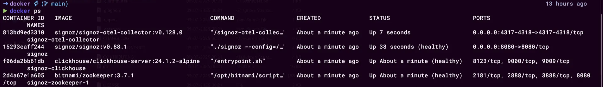
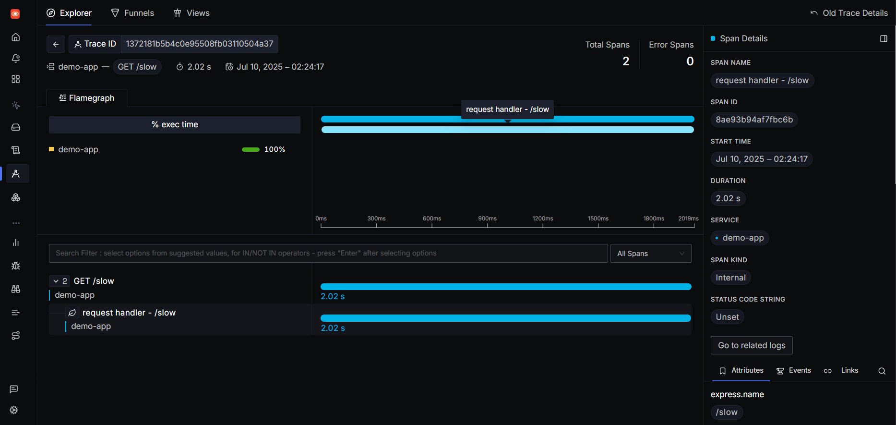
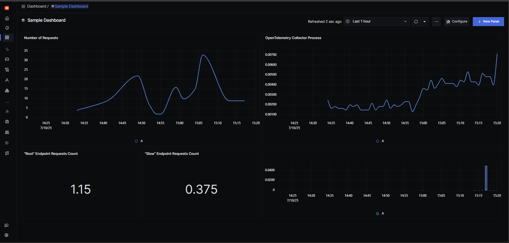

# From Zero to Observable: Instrumenting an App with OpenTelemetry and SigNoz

*Author: Aftab S*

## Introduction

Tired of playing detective every time your app goes down?

Let’s fix that. In this guide, you’ll set up a powerful, self-hosted observability stack using OpenTelemetry and SigNoz. Everything’s out in the open, nothing hidden. You’ll go from “What just happened?” to “Here’s exactly where it broke” - and fast.

---


We’ll make it happen with two power tools:

**OpenTelemetry** : The open standard for collecting traces, metrics, and logs. Vendor-neutral, flexible, and built to keep your data portable.

**SigNoz (Self-Hosted)** : An open-source alternative to tools like Datadog or New Relic, bringing you APM (Application Performance Monitoring), logs, traces, metrics, exceptions, and alerts all under one roof. One tool, total visibility.

## Before You Start

Let’s make sure your system’s ready to roll. You’ll need:

- **Docker + Docker Compose** – to run SigNoz locally
- **Git** – to clone the SigNoz repo
- **Node.js** (v16+ recommended)

That’s it. If you’ve got those, you’re good to go.

## 1. Deploy SigNoz (Self-Hosted)

Here’s where your observability backend comes alive.

First, fire up your terminal and clone the SigNoz repo. It’s packed with everything you need to spin up SigNoz using Docker Compose.

```bash
git clone -b main https://github.com/SigNoz/signoz.git
cd signoz/deploy/
```

Head into the `deploy/docker` folder, then use Docker Compose to spin up all the SigNoz services.

```bash
cd docker
docker compose up -d --remove-orphans
```

The `--remove-orphans` flag cleans up any leftover containers.

Spinning everything up might take a couple of minutes, depending on your internet speed. Run `docker ps` to check container status.

```bash
docker ps
```

Once it’s ready, you’ll see something like this:



Once all the containers are up and running, open your browser and head to `http://<IP-ADDRESS>:8080/`, replacing `<IP-ADDRESS>` with the address of the machine where SigNoz is installed. 

For example, if you’re running SigNoz locally, go to `http://localhost:8080/`; 

if it’s on a remote machine with the IP `12.34.56.789`, use `http://12.34.56.789:8080/`.


Now you can follow the on-screen instructions to create your account by providing your name, email, and setting a password.


**Congratulations! 🥳 You now have a fully operational SigNoz environment ready to receive telemetry data and give you insights into your app’s inner workings.**

## 2. Build a Sample Node.js App

Now that SigNoz is running, let’s send it some real data!

Here’s a tiny Node.js app using Express. It’s perfect for testing out your brand-new observability stack.

### Create a New Project

```bash
mkdir demo-app
cd demo-app
npm init -y
npm install express pino @opentelemetry/api dotenv
```

You can find all the code examples from this tutorial in this [GitHub repo](https://github.com/aftab-s/signoz-init.git).

### Create the App

**index.js**

```jsx
require('./instrumentation');

const express = require('express');
const pino = require('pino');
const { metrics } = require('@opentelemetry/api');

const transport = pino.transport({
  target: 'pino-opentelemetry-transport'
});

const logger = pino(transport);
const meter = metrics.getMeter('demo-app', '1.0.0');

const slowRequestCounter = meter.createCounter('slow_requests_count', {
  description: 'Counts requests to the /slow endpoint',
});

const rootRequestCounter = meter.createCounter('root_requests_count', {
  description: 'Counts requests to the root (/) endpoint',
});

const app = express();

app.get('/', (req, res) => {
  rootRequestCounter.add(1);
  logger.info('Hit / route');
  res.send('Hello from the observable world!');
});

app.get('/slow', (req, res) => {
  slowRequestCounter.add(1);
  logger.warn('Hit /slow route — simulating slow response');
  setTimeout(() => {
    res.send('This was a slow request!');
  }, 2000);
});

app.get('/error', (req, res) => {
  logger.error({
    msg: 'An error occurred!',
    error: 'Simulated error',
    stack: new Error('Simulated error').stack
  });
  res.status(500).send('Something went wrong!');
});

app.listen(3000, () => {
  logger.info('App listening on port 3000');
});
```

### What’s Happening Here?

- **`require('./instrumentation')`** : Loads your OpenTelemetry setup so all requests get traced, metrics are collected, and logs are exported to SigNoz. (For OpenTelemetry’s auto-instrumentation to do its job, it has to load before any other modules it wants to trace. That’s why `require('./instrumentation');` sits right at the top of `index.js`.)
- **Express app** : Spins up a quick web server.
- **`/` route** : Instantly replies with “Hello from the observable world!”, increments a metric, and logs an info message.
- **`/slow` route** : Pretends to be a sluggish endpoint, increments a metric, logs a warning, and waits 2 seconds before responding.
- **`/error` route** : Simulates an error, logs an error message with stack trace, and returns a 500 status.
- **Server on port 3000** : Lets you hit these routes from your browser, Postman, or `curl`.

## 3. Instrument with OpenTelemetry (Traces, Metrics, and Logs)

First things first. Let’s grab the dependencies we’ll need.

```bash
npm install @opentelemetry/sdk-node \
             @opentelemetry/auto-instrumentations-node \
             @opentelemetry/exporter-trace-otlp-http \
             @opentelemetry/exporter-metrics-otlp-http \
             @opentelemetry/exporter-logs-otlp-http \
             pino-opentelemetry-transport
```

**What do these dependencies do?**

- `@opentelemetry/sdk-node`: This is the main OpenTelemetry SDK for Node.js which handles all the heavy lifting for traces, metrics, and logs.
- `@opentelemetry/auto-instrumentations-node`: Automatically instruments popular Node.js libraries (like Express) so you get traces and metrics with zero manual patching.
- `@opentelemetry/exporter-trace-otlp-http`: Lets you export traces to SigNoz using the OTLP protocol over HTTP.
- `@opentelemetry/exporter-metrics-otlp-http`: Exports your custom metrics to SigNoz.
- `@opentelemetry/exporter-logs-otlp-http`: Exports your logs to SigNoz.
- `pino-opentelemetry-transport`: Connects the Pino logger to OpenTelemetry, so your logs are structured and exportable.

Now, we’ll auto-instrument the Express app using OpenTelemetry. To keep your code clean, put all your OpenTelemetry setup in a separate file. 

Create `instrumentation.js` in your project root.

**instrumentation.js**

```jsx
'use strict';

const { NodeSDK } = require('@opentelemetry/sdk-node');
const { getNodeAutoInstrumentations } = require('@opentelemetry/auto-instrumentations-node');
const { OTLPTraceExporter } = require('@opentelemetry/exporter-trace-otlp-http');
const { OTLPLogExporter } = require('@opentelemetry/exporter-logs-otlp-http');
const { resources } = require('@opentelemetry/sdk-node');
const { SEMRESATTRS_SERVICE_NAME, SEMRESATTRS_SERVICE_VERSION } = require('@opentelemetry/semantic-conventions');
const { OTLPMetricExporter } = require('@opentelemetry/exporter-metrics-otlp-http');
const { PeriodicExportingMetricReader } = require('@opentelemetry/sdk-metrics');
const { BatchLogRecordProcessor } = require('@opentelemetry/sdk-logs');

const resource = resources.resourceFromAttributes({
  [SEMRESATTRS_SERVICE_NAME]: 'demo-app',
  [SEMRESATTRS_SERVICE_VERSION]: '1.0.0',
});

// Point to SigNoz OTLP endpoints
// sends all your trace data aka spans to SigNoz using OTLP over HTTP
const traceExporter = new OTLPTraceExporter({
  url: 'http://localhost:4318/v1/traces',
});

// sends the custom metrics to SigNoz
const metricExporter = new OTLPMetricExporter({
  url: 'http://localhost:4318/v1/metrics',
});

// sends the logs to SigNoz
const logExporter = new OTLPLogExporter({
  url: 'http://localhost:4317/v1/logs',
});

// Create a metric reader that exports metrics every 5 seconds
const metricReader = new PeriodicExportingMetricReader({
  exporter: metricExporter,
  exportIntervalMillis: 5000,// Export every 5 seconds
});

// Create a log processor
const logProcessor = new BatchLogRecordProcessor(logExporter);

const sdk = new NodeSDK({
  resource,
  traceExporter,
  metricReader,
  logRecordProcessor: logProcessor,
  instrumentations: [getNodeAutoInstrumentations()],
});

// Initialize the SDK before the app starts
sdk.start();

console.log('OpenTelemetry instrumentation initialized: Traces, Metrics, and Logs!');
```

This file is your observability control center. It sets up OpenTelemetry to:

- Export traces, metrics, and logs to SigNoz
- Auto-instrument your app (so you don’t have to manually trace every function)
- Define your service name and version for all telemetry data
- Make sure everything starts up before your app runs

### **Run Your Instrumented Node.js App**

Fire up your app with:

```bash
node index.js
```

You should see **“OpenTelemetry instrumentation initialized: Traces, Metrics, and Logs!”** in your console. That means OpenTelemetry is hooked up and ready to go!


---

## 4. Generate Traffic

Now that your Node.js app and SigNoz are up, it’s time to test things out and see your traces, metrics, and logs in action.

Fire up your browser or use `curl` to hit your app’s endpoints a few times:

- [http://localhost:3000/](http://localhost:3000/)
    
    
    
- [http://localhost:3000/slow](http://localhost:3000/slow)
    
    
    
- [http://localhost:3000/error](http://localhost:3000/error)
    
    
    

Or use a quick script to generate more load:

```bash
for i in {1..10}; do curl http://localhost:3000/; sleep 1; done
for i in {1..5}; do curl http://localhost:3000/slow; sleep 2; done
for i in {1..3}; do curl http://localhost:3000/error; sleep 1; done
```

Each request sends traces, metrics, and logs straight into SigNoz. So go ahead and make some noise!

## 5. View Traces, Metrics, and Logs in SigNoz

### Traces

To send traces to SigNoz, the following is set up in `instrumentation.js`:

```jsx
const traceExporter = new OTLPTraceExporter({
  url: 'http://localhost:4318/v1/traces',
});
```

This exporter takes all your trace data (spans) and ships it to SigNoz’s OTLP endpoint. The SDK’s auto-instrumentation means you get traces for every HTTP request, database call, and more i.e., no manual tracing required.


Head over to the SigNoz UI and navigate to **Traces → Explorer**. Look for your service (like `demo-app` in this case) and open a trace to dive into flamegraphs, analyze latency, and inspect span details.


You should see the `/slow` endpoint showing around **2 seconds** of latency. 



A clear sign that your observability setup is capturing exactly what it should.

### Metrics

To export custom metrics, these lines in `instrumentation.js` do the trick:

```jsx
const metricExporter = new OTLPMetricExporter({
  url: 'http://localhost:4318/v1/metrics',
});
const metricReader = new PeriodicExportingMetricReader({
  exporter: metricExporter,
  exportIntervalMillis: 5000, // Export every 5 seconds
});
```

This setup ensures your custom counters (like `root_requests_count` and `slow_requests_count` from `index.js`) are sent to SigNoz every 5 seconds. The metric reader batches and exports them automatically. Again, no need to worry about manual pushes.


Navigate to **Metrics → Explorer** in SigNoz. 

Search for your custom metrics: `root_requests_count` and `slow_requests_count`. 


You’ll see real-time graphs showing how many times each endpoint was hit. These metrics are exported every 5 seconds, so give it a moment if you don’t see them right away.

You can build dashboards, set up alerts, and monitor trends directly from here. 

Here’s a sample dashboard.



### Logs

Structured log export is enabled by this addition in `instrumentation.js`:

```jsx
const logExporter = new OTLPLogExporter({
  url: 'http://localhost:4317/v1/logs',
});
const logProcessor = new BatchLogRecordProcessor(logExporter);
```

This means every log you write with Pino (info, warn, error) is sent to SigNoz, including error details and stack traces. The log processor batches logs for efficient export, so you get reliable, real-time log streams in your observability platform.

**How does Pino fit in?** Unlike traces and metrics, which are handled almost entirely by OpenTelemetry’s SDK and auto-instrumentation, logs in this app are generated using [Pino](https://getpino.io/), a fast, structured logger for Node.js. Here’s why and how it works:

- **Structured Logging:** Pino outputs logs as JSON objects, making them easy to parse, search, and correlate in observability tools like SigNoz.
- **Log Levels:** You can log at different levels (`info`, `warn`, `error`), and these are preserved and filterable in SigNoz’s UI.
- **OpenTelemetry Integration:** The `pino-opentelemetry-transport` package acts as a bridge, taking Pino’s logs and sending them to OpenTelemetry’s log pipeline.
- **Manual Logging:** You can decide what to log and when. So you can capture business events, errors, or anything else that matters to you, with full control over the log content.

That being said, head over to **Logs → Explorer**. Filter by your service name (`demo-app`) and log levels (INFO, WARN, ERROR). You’ll see structured logs for every request, including error details and stack traces for `/error` requests. 


Logs are correlated with traces, so you can jump from a log entry straight to the trace that caused it.


## That’s a wrap!

By following these steps, you’ve turned your Node.js Express app into a fully observable powerhouse - collecting traces, custom metrics, and structured logs, all flowing into **SigNoz**. You’re now equipped to:

- **Spot latency bottlenecks:** Instantly see where requests slow down.
- **Track key metrics:** Monitor how your endpoints perform and how often they’re hit.
- **Debug faster:** Correlate traces and logs to zero in on issues without guesswork.
- **Understand your app’s flow:** Get the big picture of how services talk to each other.

And the best part? You’ve gone from **zero visibility** to crystal-clear insights with just a few steps. This walkthrough used Node.js and Express, but the same OpenTelemetry magic works across Go, Python, Java, or whatever stack you’re building next.

**Instrument → Export → Observe**

This is the foundation for reducing downtime and truly understanding how your systems behave.

And just like that, you’ve got a clear, unified view of your app’s health. Here’s a simple dashboard to bring it all together:


**Happy observing!**